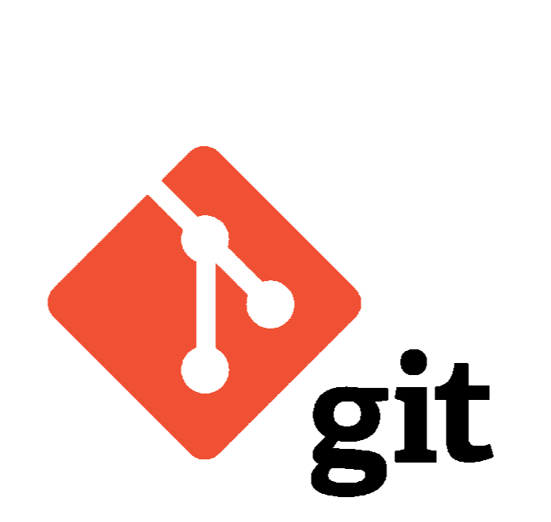

# Инструкция для работы с Git и удалёнными репозиториями

## I. Что такое Git?
Git - это одна из реализаций распределённых систем контроля версий, имеющая как и локальные, так и удалённые репозитории. Является самой популярной реализацией систем контроля версий в мире.

## II. Подготовка репозитория
Для создание репозитория необходимо выполнить команду *git init*  в папке с репозиторием и у Вас создаться репозиторий (появится скрытая папка .git)

*(Прим.: указывать путь к папке через вкладку "Проводник", слева получится список файлов)*

## III. Создание коммитов

### Git add
Для добавления измений в коммит используется команда *git add*. Чтобы использовать команду *git add* напишите *git add <имя файла>*

*(Прим.: указывать имя можно с помощью кнопки "__Tab__", начинаем набирать текст -> Tab для быстрого вызова файлов с таким же началом имени в папке)*

### Просмотр состояния репозитория
Для того, чтобы посмотреть состояние репозитория используется команда *git status*. Для этого необходимо в папке с репозиторием написать *git status*, и Вы увидите были ли измения в файлах, или их не было.

### Создание коммитов
Для того, чтобы создать коммит(сохранение) необходимо выполнить команду *git commit*. Выполняется она так: *git commit -m "<сообщение к коммиту>*. Все файлы для коммита должны быть ***ДОБАВЛЕНЫ*** и сообщение к коммиту писать ***ОБЯЗАТЕЛЬНО***.

*(Прим.: так же можно использовать "__am__" (__A__(dd)__M__(essage), но только для сохранённых файлов.)*

## IV. Перемещение между сохранениями
Для того, чтобы перемещаться между коммитами, используется команда *git checkout*. Используется она в папке с пепозиторием следующим образом: *git checkout <номер коммиты> (можно не полностью)*

## V. Журнал изменений
Для того, чтобы посмтреть все сделанные изменения в репозитории, используется команда *git log*. Для этого достаточно выполнить команду *git log* в папке с репозиторием

*(Прим.: здесь никаких дополнительных имён файлов указывать __не нужно__!)*

## VI. Ветки в Git

### Создание ветки

Для того, чтобы создать ветку, используется команда *git branch*. Делается это следующим образом в папке с репозиторием: *git branch <название новой ветки>*

*(Прим.: по умолчанию используется ветка __master__)*

## VII. Слияние веток

Для того чтобы дабавить ветку в текущую ветку используется команда *git merge <name branch>*

## VIII. Удаление веток
Для удаления ветки ввести команду "git branch -d 'name branch'"

## VI. Удалённые репозитории
Слово «удалённые» не означает удалённые нами репозитории. На самом деле мы работаем с репозиториями, которые находятся не на нашем компьютере. То есть у нас есть локальные репозитории, находящиеся на нашем ноутбуке или компьютере, и удалённые, располагающиеся удалённо от нас, где-то в другом месте. Это может быть какой-то сервер, компьютер нашего друга или ещё что-то. Главное, что эти репозитории находится не на нашем компьютере.

### Команды для работы с удалёнными репозиториями

__git clone__ - команда позволяет склонировать внешний репозиторий на свой ПК

__git pull__ - позволяет скачать из текущего репозитория и *сделать слияние веток __(merge)__* с нашей версией на ПК

__git push__ - отправляет __вашу__ ветку репозитория на __внешний__. *__Внимание!__ Эта операция требует __авторизации__ на внешнем репозитории!*
